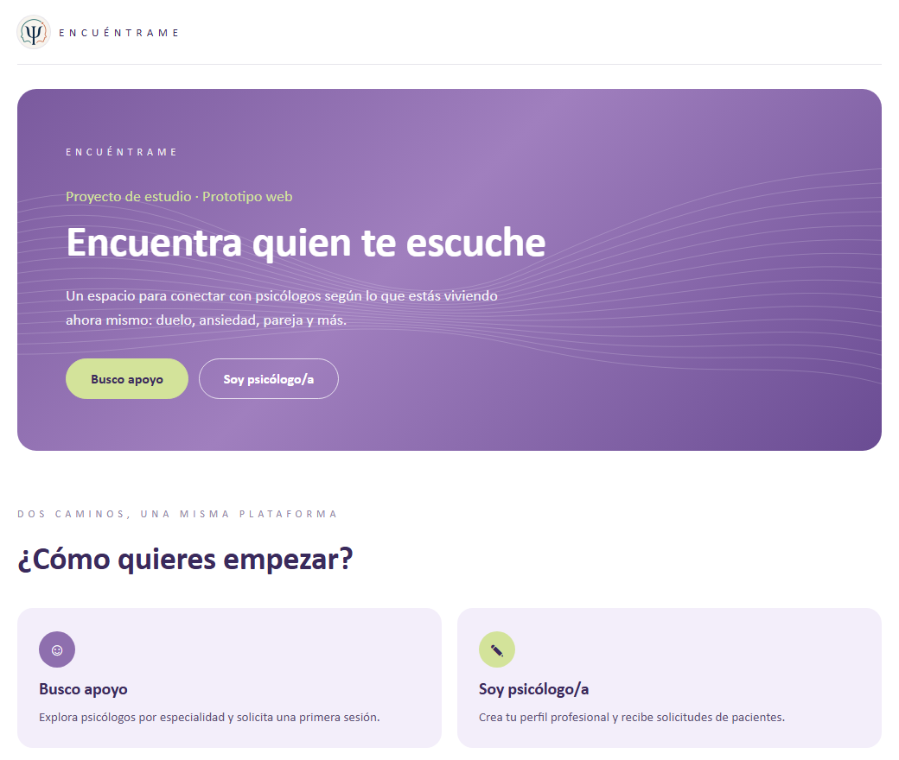

  

<b>👨‍💻​ Estudiante de DAM en CEAC · Aprendiendo a crear aplicaciones multiplataforma</b>

  
  
  
  

  

  

---

## 🙋‍♂️ Sobre mí

Actualmente estoy estudiando **Desarrollo de Aplicaciones Multiplataforma (DAM)** y utilizando GitHub para aprender, practicar y compartir mis proyectos.

Estoy construyendo mis conocimientos desde cero y trabajando principalmente en programación, desarrollo web y herramientas utilizadas en el mundo del desarrollo de software.

## 🚀 Actualmente estoy aprendiendo

  

| | | |
|:--|:--|:--|

| 🐍 Python | 🌐 HTML | 🎨 CSS |

| 💻 Desarrollo de aplicaciones | 🗄️ Bases de datos | 🔧 Git y GitHub |

| 🐧 Linux | 📚 Fundamentos de programación | |

## 💼 Proyectos

### 🧠 Encuéntrame — psicólogos y pacientes

Aplicación web para ayudar a las personas a encontrar al psicólogo que mejor se adapta a su necesidad.

- 🙋 **Área de pacientes:** registro, búsqueda por nombre y especialidad y envío de solicitudes de atención.
- 🩺 **Área de psicólogos:** perfil profesional y gestión de las solicitudes recibidas.
- 📱 Diseño adaptable a móvil y modo claro/oscuro.

  
  
  
  
  

## 📂 En este GitHub

Aquí iré publicando:

- 🎓 Proyectos realizados durante mis estudios
- 🧩 Ejercicios de programación
- 🐍 Prácticas de Python
- 🌐 Proyectos web
- 🧪 Aplicaciones y pequeños experimentos
- ❤️ Proyectos personales

Mi objetivo es documentar mi evolución como desarrollador y crear poco a poco un **porfolio de proyectos reales**.

## 📈 Mi objetivo

Seguir aprendiendo, mejorar mis habilidades de programación y adquirir experiencia práctica en el desarrollo de software.

> 💡 *Cada proyecto es una oportunidad para aprender algo nuevo.*

---

## 📫 Contacto

Puedes contactar conmigo a través de GitHub, LinkedIn o correo electrónico.

  
  
  

---

  

